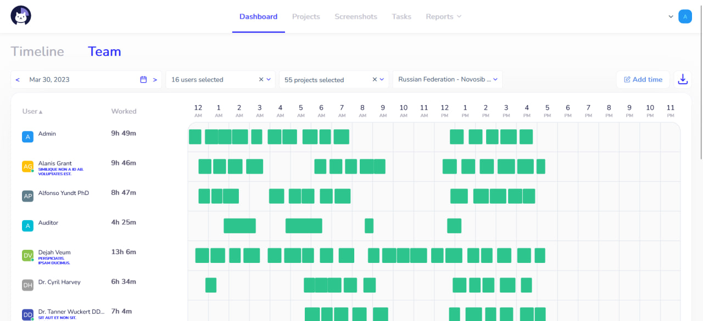
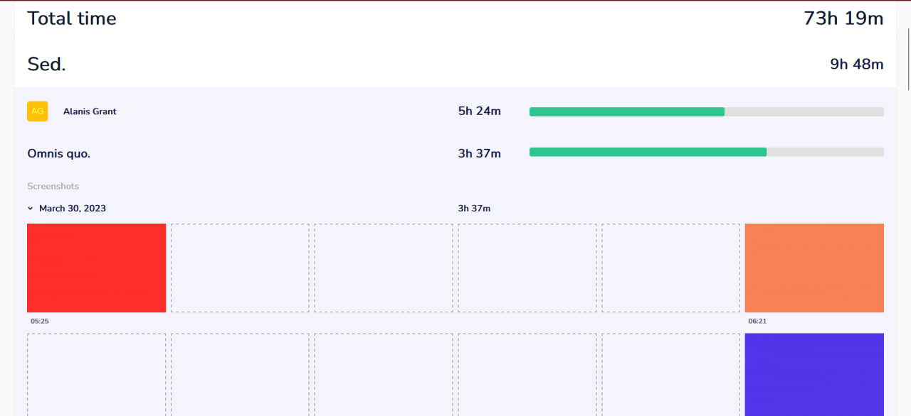

# Cattr

Self-hosted time tracking and project management platform with activity tracking,
screenshots, reports, and a public API.

[Website](https://cattr.app) ·
[Demo](https://demo.cattr.app) ·
[Documentation](https://docs.cattr.app) ·
[Discussions](https://github.com/orgs/cattr-app/discussions)

## Screenshots

|                  Dashboard                   |                     Project report                     |
|:--------------------------------------------:|:------------------------------------------------------:|
|  |  |

## Features

- Time tracking across projects and tasks
- Project and task management
- Screenshot and activity tracking
- Dashboard and configurable reports
- Offline synchronization
- Team, user, and role management
- Task comments and attachments
- Public API
- Extensible module system

## Try Cattr

A public demo is available at [demo.cattr.app](https://demo.cattr.app).

## Installation

Cattr is designed to run on your own infrastructure.

See the [installation guide](https://docs.cattr.app/#/en/getting-started/)
for requirements, deployment, and configuration.

Container images are published to:

`ghcr.io/cattr-app/server`

## API

Cattr provides an HTTP API for projects, tasks, users, time intervals,
screenshots, reports, company settings, attachments, and offline synchronization.

See the [API documentation](https://api.docs.cattr.app).

## Desktop application

The Cattr desktop client provides native time tracking and activity collection.

- [Source code](https://github.com/cattr-app/desktop-application)
- [Downloads](https://cattr.app/desktop/)

## Development

Interested in contributing or building Cattr locally?

See [CONTRIBUTING.md](./CONTRIBUTING.md).

## Documentation

- [User Guide](https://docs.cattr.app)
- [API Reference](https://api.docs.cattr.app)
- [Backend Documentation](https://backend.docs.cattr.app)
- [Frontend Documentation](https://frontend.docs.cattr.app)

## Community

For questions and general discussion, use
[GitHub Discussions](https://github.com/orgs/cattr-app/discussions).

For bugs and feature requests, use
[GitHub Issues](https://github.com/cattr-app/server-application/issues).

## License

Cattr Server is distributed under the
[Server Side Public License 1.0](./LICENSE).
